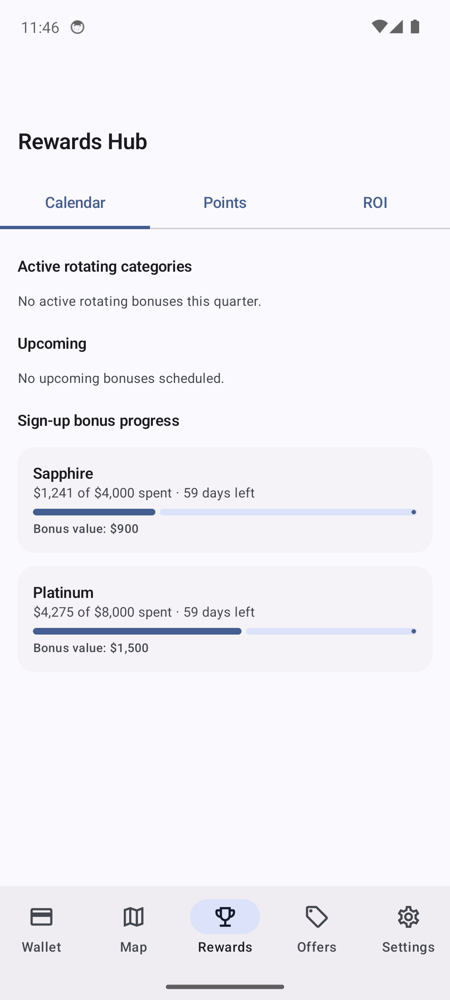
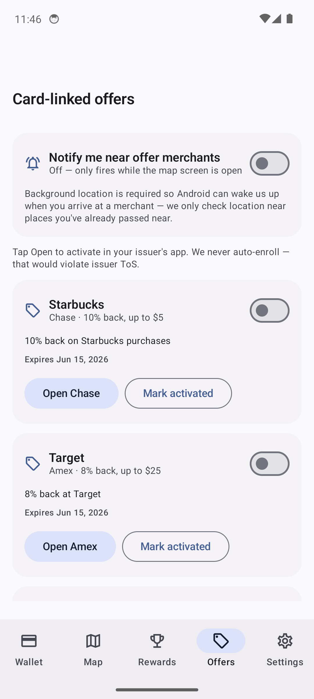
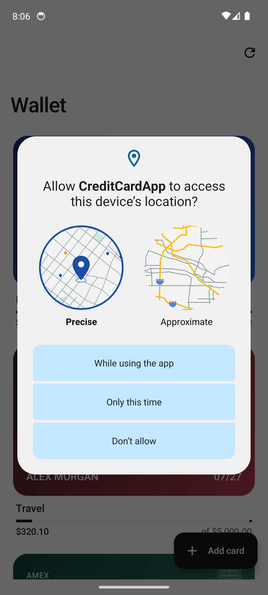
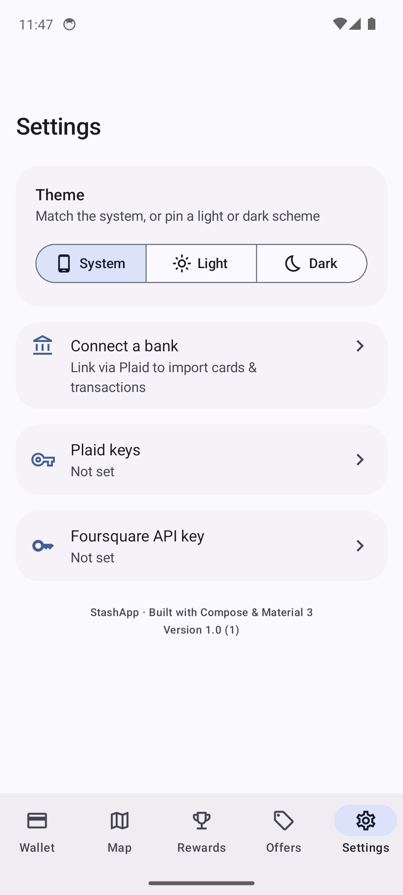

# StashApp — Best Credit Card Nearby

Android app that tells you **which credit card to swipe at the business in front of you** for the highest rewards. Pulls your linked cards via Plaid, finds nearby businesses via Foursquare + OpenStreetMap, and ranks every visible place by the multiplier your cards earn there.

<p align="center">
  
  
  
  
</p>

<p align="center">
  <a href="https://hbirring01.github.io/CreditCardApp/privacy.html"><b>Privacy policy</b></a> ·
  <a href="RELEASING.md">Release checklist</a> ·
  <a href="server/README.md">Plaid proxy server</a>
</p>

---

## What's new in v1.7.4

- 🧠 **AI cache management** — the AI Assist dialog now shows how many merchant verdicts are cached and lets you wipe them with one tap. Handy after switching providers or when you think a cached "NO" was wrong; next sync will re-ask the model within the per-batch budget.
- 🩹 **Fixed broken `app_logo.xml`** that was crashing the build (SVG-style `<rect>` elements aren't supported by Android vector drawables — converted to `<path>` with proper rounded-rect path data).
- 🩹 **Fixed missing imports in `BiometricGate.kt`** for `R`, `painterResource`, and `Modifier.width` so the lock screen logo compiles.

## What's new in v1.7.3

- 🐛 **Foursquare parse fix** — categories without an `id` field no longer abort the nearby fetch with `Field 'id' is required for type … FsqCategory`. Fixes the "businesses pop up then disappear" regression in v1.7.2.

## What's new in v1.7.2

- 🌐 **Multi-mirror Overpass fallback** — when the primary mirror (kumi.systems) is slow or down, the app now automatically tries the official `overpass-api.de` and `overpass.openstreetmap.fr` mirrors before giving up. Fixes "no businesses found" on the Rewards map.
- 🩹 **Repaired corrupted `PlacesRepository.kt`** that had been silently latent (a stray shell command had been pasted into the source years ago; only surfaced on a forced recompile).
- 💬 **Clearer error messages** on the Rewards map — when a nearby fetch actually fails, the toast now shows the underlying reason instead of a generic message.

## What's new in v1.7.1

- 🪪 **Per-usage source badges** — expand any credit on the Credits tab to see its individual usages with **AI** / **AUTO** labels, so it's obvious how each charge was matched.
- 🗑️ **Inline delete on usage rows** — tap the × on any usage to remove it. Auto/AI usages are remembered as dismissed so they won't be re-added on the next sync.
- ⬇️ **Tap-to-expand credit rows** — chevron indicator + clickable header for the usage list.

## What's new in v1.7.0

- 🤖 **AI Assist for credit matching** — when a Plaid transaction doesn't match a credit's literal rules (`uber`, `TRAVEL`, etc.), an opt-in LLM is asked one short question: *"does this merchant qualify?"* Catches obfuscated descriptors like `SQ *UBR EATS NYC`, `PAYPAL *DISNEY PLUS`, `TST* MARRIOTT BONVOY` that pattern rules miss.
- 🔑 **Bring-your-own free key** — defaults to **Google Gemini 2.0 Flash** (1,500 req/day free at `aistudio.google.com`). Also supports **Groq**, **OpenRouter**, and **Custom** (Ollama / self-hosted) via an OpenAI-compatible client.
- 💾 **Per-merchant cache** — each normalized merchant string is asked about at most once per credit; weekly Uber rides hit the cache, not the API.
- 🪙 **Per-batch budget** — soft cap of 25 LLM calls per Plaid sync to keep free tiers comfortable even on a year-of-history backfill.
- 🔒 **Off by default, encrypted at rest** — API key lives in the same `EncryptedSharedPreferences` (AES-256-GCM, Android Keystore) as the Plaid and Foursquare keys. Settings only ever shows status, never the key.
- 🗄️ **Schema v9** — adds `ai_match_cache(creditId, merchantNorm)`. Migration `8→9` is included; no data loss.

## What's new in v1.6.0

- 🤖 **Auto-tracked statement credits** — credits now match against your Plaid transactions automatically. Each credit gets a merchant pattern (e.g. `uber|lyft`) and/or a Plaid category (e.g. `TRAVEL`); matching charges are logged on the fly (capped at the remaining amount) so the progress bar moves without manual entry.
- 🔁 **Backfill on save** — editing a credit immediately scans existing transactions in the current period so newly added rules catch up without waiting for the next sync.
- 🚫 **Sticky dismissals** — deleting an auto-logged usage records a dismissal so the next sync won't bring it back.
- 🌱 **Smart seed rules** — sample credits ship with sensible defaults (Uber Cash → "uber", Hotel → major chains, Airline → major carriers, Digital Entertainment → streaming providers).
- 🗄️ **Schema v8** — adds `matchPattern`/`matchCategory`/`autoTrack` to credits, `transactionId`/`source` to usages, a unique `(creditId, transactionId)` index, and a new `dismissed_credit_matches` table. Migration `7→8` is included; no data loss.

## What's new in v1.5.1

- 🧷 **One-line bottom-tab labels** — "Rewards" no longer wraps to "Reward" + "s" on narrower devices. All tab labels are now single-line with ellipsis overflow.

## What's new in v1.5.0

- 💰 **Statement Credit Tracker** — track recurring perks like Amex Platinum's $200 hotel credit or Chase Sapphire Reserve's $300 travel credit. Each credit has a period (monthly / quarterly / semi-annual / annual), an amount, and a running progress bar against logged usages.
- 🧾 **Per-credit usage history** — log charges manually with merchant, amount, and date; see total used vs. remaining in the current period.
- 🆕 **Dedicated Credits tab** in the bottom navigation.

## What's new in v1.4.3

- 📸 **Refreshed screenshots** in the README — fresh captures of the new Rewards / Offers / Wallet / Settings screens on a Pixel API 34 emulator.
- 🔓 **`FLAG_SECURE` is now release-only** — the screenshot/recording block remains on for production APKs (protecting card numbers, balances, and Plaid setup), but is disabled in debug builds so the Layout Inspector and dev screenshots work.

## What's new in v1.4.2

- 🔢 **Version info in Settings** — the bottom of the Settings screen now shows the installed `versionName` and `versionCode`, so it's obvious which build you're running when filing feedback.

## What's new in v1.4.1

- 🧭 **Rewards and Offers split into dedicated bottom tabs** — the combined hub is now two focused destinations: a Rewards tab (map + best-card hero) and an Offers tab (issuer offers tracker). Cleaner navigation, faster access, and less context-switching when you're standing at the register.
- 🗺️ **Stabilized map & list scrolling** — refined gesture handling on the Rewards map and the Offers list so panning, pull-to-refresh, and button taps no longer fight each other.

## What's new in v1.4.0

- 🎯 **Card-linked offers tracker** — surfaces active issuer offers (Amex, Chase, etc.) you can manually add, see your savings progress on, and one-tap deep-link into the issuer app to activate.
- 🛎️ **Proximity notifications** — when you walk into a place that matches one of your unactivated offers, you get a notification with a tap-through to activate. Works both in the foreground (map open) and **in the background via system geofences** — fully opt-in with a clear two-step location permission flow.
- 🔁 **Boot recovery** — geofences are automatically re-installed after device reboot or app upgrade via a `BroadcastReceiver` + `HiltWorker`, so background offer alerts survive power cycles without needing you to reopen the app.
- 🤖 **AI Best-Card hero** on the map (v1.3) — picks the optimal card for the focused place using effective multiplier (base vs. quarterly rotating bonus), then breaks ties using sign-up bonus progress.
- 🔐 **Write-only API key management** in Settings (v1.3) — keys stored in `EncryptedSharedPreferences` backed by the Android Keystore.
- 📄 **Public privacy policy** at [hbirring01.github.io/CreditCardApp/privacy.html](https://hbirring01.github.io/CreditCardApp/privacy.html) — required for Plaid production access.

## Features

- 🗺️ **Rewards map** — Google-Maps-style tiles (CARTO Voyager) with colored markers by reward category (dining, gas, groceries, travel, shopping, entertainment).
- 💳 **Best-card recommendations** — every business is matched against your linked cards and ranked by per-dollar multiplier. Tap a card to see alternative options and expected points on a sample $50 spend.
- 📍 **Smart location** — auto-detect via GPS, or manually type a city / ZIP / address.
- 🔍 **Two search modes**
  - **Nearest match (in-list, ~30 mi)**: type a name in the lower search box; hits Foursquare's name-aware search and falls back to Overpass (OSM `name`/`brand`/`operator` regex) when no key is set.
  - **Anywhere (global, top bar)**: type `"Mezeh in Ellicott City"` or `"Best Buy near 90210"` — searches with Foursquare's `near=` parameter, no device location required.
- 🎯 **Category filter chips + sort toggle** — switch between sort-by-distance and sort-by-multiplier.
- 🔁 **Pull-to-refresh** + **"Search this area"** floating button when you pan the map.
- 🔒 **Encrypted local storage** — Room + SQLCipher for transaction cache, EncryptedSharedPreferences for Plaid tokens and Foursquare key, biometric/PIN-locked app entry.
- 🏦 **Plaid Link** — link real bank accounts in sandbox or production; transactions hydrate the card list and categorize spending.
- 📐 **Imperial units** throughout (feet up to ~⅒ mi, then miles).

<p align="center">
  
</p>

## Architecture

Single-module Android app, **MVVM + Hilt + Coroutines + Compose**.

```
app/
├── data/
│   ├── local/        Room DAOs, SQLCipher, migrations
│   ├── plaid/        Plaid API client + EncryptedSharedPreferences credentials store
│   ├── places/       Foursquare + Overpass repository
│   ├── preferences/  ApiKeyStore (write-only Foursquare key)
│   └── location/     FusedLocation + Geocoder
├── di/               Hilt modules (Network, Database, Plaid)
├── domain/           CreditCard, RewardCategory, multipliers
└── ui/
    ├── auth/         Biometric + PIN gate
    ├── home/         Dashboard
    ├── rewards/      Map screen (osmdroid + Compose) · BestCardHero
    ├── cards/        Add/edit cards
    ├── settings/     API key + Plaid management dialogs
    └── plaidsetup/   Plaid Link launcher
server/               Optional Node.js Plaid proxy (sandbox)
docs/                 Privacy policy + landing page (GitHub Pages)
```

| Layer        | Stack                                                                |
| ------------ | -------------------------------------------------------------------- |
| UI           | Jetpack Compose · Material 3 · Compose Navigation                    |
| State        | ViewModel + StateFlow                                                |
| DI           | Hilt 2.52                                                            |
| Persistence  | Room 2.6.1 · SQLCipher 4.5.4 · EncryptedSharedPreferences (Tink)     |
| Networking   | Retrofit 2.11.0 · OkHttp 4.12.0 · kotlinx-serialization 1.7.2        |
| Maps         | osmdroid 6.1.18 · CARTO Voyager raster tiles                         |
| Places       | Foursquare Places API (2025-06-17) · Overpass / OpenStreetMap        |
| Geocoding    | Android `Geocoder`                                                   |
| Banking      | Plaid Link Android SDK 4.6.0                                         |
| Security     | AndroidX Biometric 1.2 · BCrypt PIN hashing · Android Keystore       |
| Build        | AGP 8.5.2 · Kotlin 2.0.20 · KSP 2.0.20-1.0.25 · Gradle 8.7 · JDK 17  |

## Getting started

### Prerequisites

- Android Studio Koala+ (AGP 8.5.2)
- JDK 17
- Android SDK platform 34, build-tools 34.x
- Physical device or emulator running Android 8.0 (API 26) or higher

### Clone & configure

```bash
git clone https://github.com/hbirring01/CreditCardApp.git
cd CreditCardApp
```

Create `local.properties` (already git-ignored) with at minimum:

```properties
sdk.dir=C:\\Users\\<you>\\AppData\\Local\\Android\\Sdk

# Optional — bakes a default Foursquare key into the build. Users can override
# it at runtime under Settings → Foursquare API key (stored encrypted).
# Get a free key at https://foursquare.com/developers/
FOURSQUARE_API_KEY=fsq3YOUR_KEY_HERE

# Optional — release signing
# RELEASE_STORE_FILE=/path/to/keystore.jks
# RELEASE_STORE_PASSWORD=…
# RELEASE_KEY_ALIAS=…
# RELEASE_KEY_PASSWORD=…
```

### Build & run

```bash
./gradlew assembleDebug
./gradlew installDebug
```

Or open the project in Android Studio and hit ▶.

### Plaid setup

Tap **Set up Plaid** on first launch (or **Settings → Plaid keys** later) and paste:

- **Client ID** + **Secret** from https://dashboard.plaid.com/developers/keys
- Choose `sandbox` to use Plaid's test bank fixtures, or `production` once your app is approved.

Keys are stored in `EncryptedSharedPreferences` and never displayed back. To rotate, just paste a new value over the old one.

The bundled `server/` directory has a small Node.js proxy that exchanges public tokens for access tokens — required for any non-trivial use. See [server/README.md](server/README.md).

## Configuration knobs

| What                       | Where                                            |
| -------------------------- | ------------------------------------------------ |
| Foursquare key (build)     | `local.properties` → `FOURSQUARE_API_KEY`        |
| Foursquare key (runtime)   | Settings → Foursquare API key                    |
| Plaid client ID / secret   | Settings → Plaid keys                            |
| Build output directory     | Env var `ANDROID_BUILD_DIR` (overrides default)  |
| Map default location       | `RewardsMapScreen.kt` → `DEFAULT_LAT/LON`        |
| Default radius cascade     | `PlacesRepository.kt` → `nearby()` radii         |
| Sample spend for points    | `RewardsMapScreen.kt` → `SAMPLE_SPEND_DOLLARS`   |

## CI

GitHub Actions runs `./gradlew assembleDebug` on every push to `main`. The build directory is automatically redirected away from OneDrive on local Windows builds; CI uses the default `app/build`.

## Privacy

Everything sensitive stays on-device:

- Plaid access tokens, client ID, secret → `EncryptedSharedPreferences` (Tink + AES-256-GCM, master key in Android Keystore)
- Foursquare runtime key → same encrypted store
- Transaction cache → SQLCipher-encrypted Room DB
- PIN → BCrypt hash (cost 12)
- No analytics, no third-party crash reporters, no telemetry

The only outbound network calls are to: Plaid (banking), Foursquare (places), Overpass (places), CARTO (tiles), and Android's geocoder.

Full policy: [hbirring01.github.io/CreditCardApp/privacy.html](https://hbirring01.github.io/CreditCardApp/privacy.html)

## Releasing

See [RELEASING.md](RELEASING.md) — every release tags a version, refreshes screenshots, and updates this README.

## License

MIT — see [LICENSE](LICENSE) (add one if you plan to distribute).

## Acknowledgements

- [Plaid](https://plaid.com/) for the Link SDK
- [Foursquare](https://foursquare.com/developers/) for the Places API
- [OpenStreetMap contributors](https://www.openstreetmap.org/copyright) for Overpass data
- [CARTO](https://carto.com/attributions) for the Voyager tile style
- [osmdroid](https://github.com/osmdroid/osmdroid) for the Android map view
