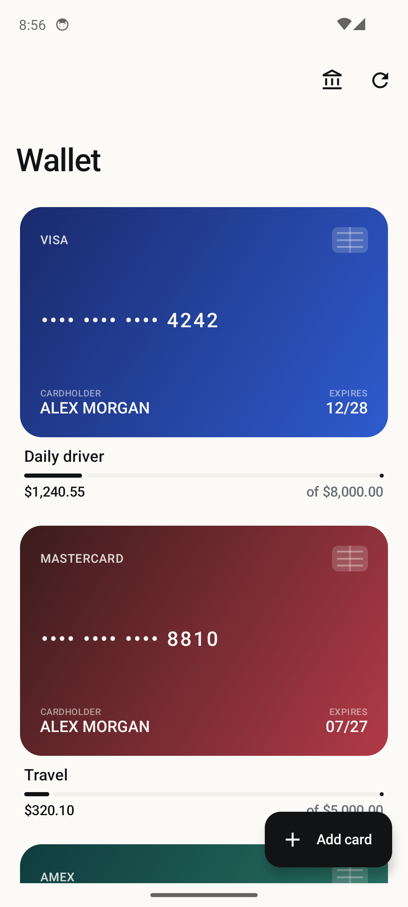

# StashApp — Best Credit Card Nearby

Android app that tells you **which credit card to swipe at the business in front of you** for the highest rewards. Pulls your linked cards via Plaid, finds nearby businesses via Foursquare + OpenStreetMap, and ranks every visible place by the multiplier your cards earn there.

<p align="center">
  
</p>

---

## Features

- 🗺️ **Rewards map** — Google-Maps-style tiles (CARTO Voyager) with colored markers by reward category (dining, gas, groceries, travel, shopping, entertainment).
- 💳 **Best-card recommendations** — every business is matched against your linked cards and ranked by per-dollar multiplier. Tap a card to see the alternative options and the expected points on a sample $50 spend.
- 📍 **Smart location** — auto-detect via GPS, or manually type a city / ZIP / address.
- 🔍 **Two search modes**
  - **Nearest match (in-list, ~30 mi)**: type a name in the lower search box; hits Foursquare's name-aware search and falls back to Overpass (OSM `name`/`brand`/`operator` regex) when no key is set.
  - **Anywhere (global, top bar)**: type `"Mezeh in Ellicott City"` or `"Best Buy near 90210"` — searches with Foursquare's `near=` parameter, no device location required.
- 🎯 **Category filter chips + sort toggle** — switch between sort-by-distance and sort-by-multiplier.
- 🔁 **Pull-to-refresh** + **"Search this area"** floating button when you pan the map.
- 🔒 **Encrypted local storage** — Room + SQLCipher for transaction cache, EncryptedSharedPreferences for Plaid tokens, biometric/PIN-locked app entry.
- 🏦 **Plaid Link** — link real bank accounts in sandbox or production; transactions hydrate the card list and categorize spending.
- 📐 **Imperial units** throughout (feet up to ~⅒ mi, then miles).

## Architecture

Single-module Android app, **MVVM + Hilt + Coroutines + Compose**.

```
app/
├── data/           Room DAOs, SQLCipher, Plaid API, Foursquare API, Overpass API, location/geocoder
├── di/             Hilt modules (Network, Database, Plaid)
├── domain/         CreditCard, RewardCategory, multipliers
└── ui/
    ├── auth/       Biometric + PIN gate
    ├── home/       Dashboard
    ├── rewards/    Map screen (osmdroid + Compose)
    ├── cards/      Add/edit cards
    └── plaidsetup/ Plaid Link launcher + credentials
server/             Optional Node.js Plaid proxy (sandbox)
```

| Layer        | Stack                                                                |
| ------------ | -------------------------------------------------------------------- |
| UI           | Jetpack Compose · Material 3 · Compose Navigation                    |
| State        | ViewModel + StateFlow                                                |
| DI           | Hilt 2.52                                                            |
| Persistence  | Room 2.6.1 · SQLCipher 4.5.4 · EncryptedSharedPreferences            |
| Networking   | Retrofit 2.11.0 · OkHttp 4.12.0 · kotlinx-serialization 1.7.2        |
| Maps         | osmdroid 6.1.18 · CARTO Voyager raster tiles                         |
| Places       | Foursquare Places API (2025-06-17) · Overpass / OpenStreetMap        |
| Geocoding    | Android `Geocoder`                                                   |
| Banking      | Plaid Link Android SDK                                               |
| Security     | AndroidX Biometric 1.2 · BCrypt PIN hashing                          |
| Build        | AGP 8.5.2 · Kotlin 2.0.20 · KSP 2.0.20-1.0.25 · Gradle 8.7 · JDK 17  |

## Getting started

### Prerequisites

- Android Studio Koala+ (AGP 8.5.2)
- JDK 17
- Android SDK platform 34, build-tools 34.x
- Physical device or emulator running Android 8.0 (API 26) or higher

### Clone & configure

```bash
git clone https://github.com/hbirring01/CreditCardApp.git
cd CreditCardApp
```

Create `local.properties` (already git-ignored) with at minimum:

```properties
sdk.dir=C:\\Users\\<you>\\AppData\\Local\\Android\\Sdk

# Optional but recommended — enables global business search + better nearby results.
# Get a free key at https://foursquare.com/developers/
FOURSQUARE_API_KEY=fsq3YOUR_KEY_HERE

# Optional — release signing
# RELEASE_STORE_FILE=/path/to/keystore.jks
# RELEASE_STORE_PASSWORD=…
# RELEASE_KEY_ALIAS=…
# RELEASE_KEY_PASSWORD=…
```

### Build & run

```bash
./gradlew assembleDebug
# install on a running device/emulator:
./gradlew installDebug
```

Or open the project in Android Studio and hit ▶.

### Plaid setup (optional)

The first time you open the app, tap **Set up Plaid** and paste:

- **Client ID** + **Sandbox Secret** from https://dashboard.plaid.com/developers/keys
- Leave the environment as `sandbox` to use Plaid's test bank fixtures (no real SMS / no bills).

The bundled `server/` directory has a 50-line Node.js proxy that exchanges public tokens for access tokens against the Plaid API — required for any non-trivial use. See [server/README.md](server/README.md).

## Configuration knobs

| What                       | Where                                       |
| -------------------------- | ------------------------------------------- |
| Foursquare key             | `local.properties` → `FOURSQUARE_API_KEY`   |
| Build output directory     | Env var `ANDROID_BUILD_DIR` (overrides default) |
| Map default location       | `RewardsMapScreen.kt` → `DEFAULT_LAT/LON`   |
| Default radius cascade     | `PlacesRepository.kt` → `nearby()` radii    |
| Sample spend for points    | `RewardsMapScreen.kt` → `SAMPLE_SPEND_DOLLARS` |

## CI

GitHub Actions runs `./gradlew assembleDebug` on every push to `main`. The build directory is automatically redirected away from OneDrive on local Windows builds; CI uses the default `app/build`.

## Privacy

Everything sensitive stays on-device:

- Plaid access tokens → `EncryptedSharedPreferences` (Tink + AES-256-GCM)
- Transaction cache → SQLCipher-encrypted Room DB
- PIN → BCrypt hash (cost 12)
- No analytics, no third-party crash reporters, no telemetry

The only outbound network calls are to: Plaid (banking), Foursquare (places), Overpass (places), CARTO (tiles), and Android's geocoder.

## License

MIT — see [LICENSE](LICENSE) (add one if you plan to distribute).

## Acknowledgements

- [Plaid](https://plaid.com/) for the Link SDK
- [Foursquare](https://foursquare.com/developers/) for the Places API
- [OpenStreetMap contributors](https://www.openstreetmap.org/copyright) for Overpass data
- [CARTO](https://carto.com/attributions) for the Voyager tile style
- [osmdroid](https://github.com/osmdroid/osmdroid) for the Android map view
